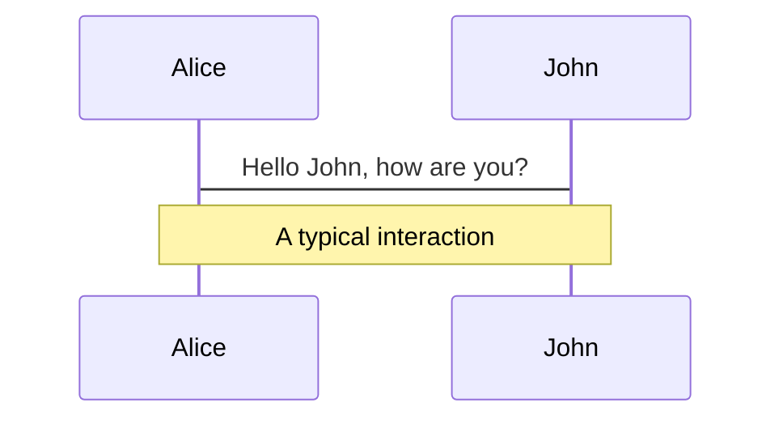
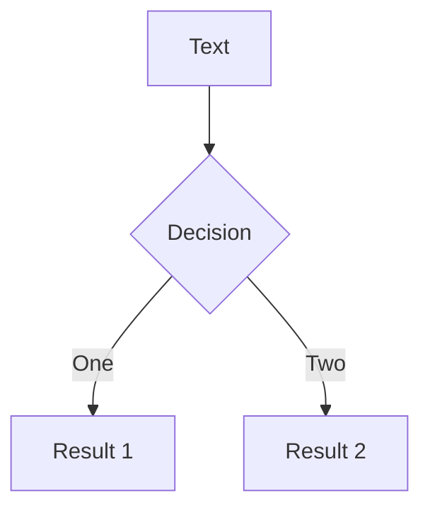
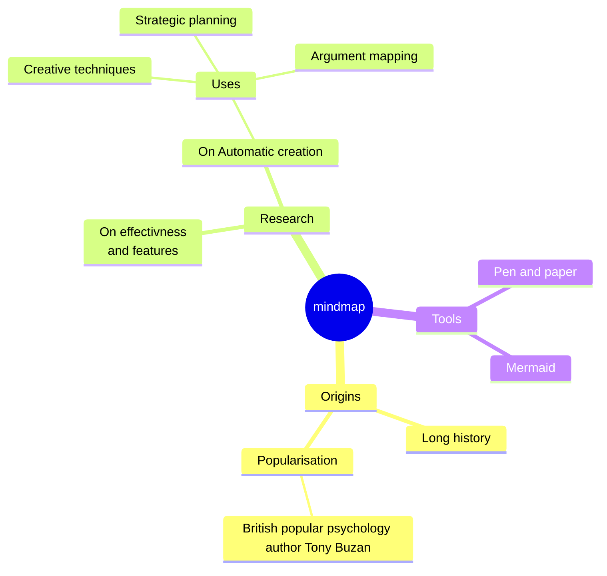

# Slidev

基于 Web 的幻灯片制作和演示工具

<div class="pt-12">
  <span @click="$slidev.nav.next" class="px-2 py-1 rounded cursor-pointer" hover="bg-white bg-opacity-10">
    请按下空格建切换到下一页 <carbon:arrow-right class="inline"/>
  </span>
</div>

<div class="abs-br m-6 flex gap-2">
  <button @click="$slidev.nav.openInEditor()" title="Open in Editor" class="text-xl slidev-icon-btn opacity-50 !border-none !hover:text-white">
    <carbon:edit />
  </button>
  <a href="https://github.com/slidevjs/slidev" target="_blank" alt="GitHub"
    class="text-xl slidev-icon-btn opacity-50 !border-none !hover:text-white">
    <carbon-logo-github />
  </a>
</div>

<style>
h1 {
  color: #2B90B6;
  border-bottom: 0;
  background-image: linear-gradient(45deg, #4EC5D4 10%, #146b8c 20%);
}
</style>

---
transition: fade-out
layout: center
---

# Slidev是什么?

#### Slidev是基于 Web 的幻灯片制作和演示工具。它旨在让开发者专注在 Markdown 中编写内容，同时拥有支持 HTML 和 Vue 组件的能力，并且能够呈现像素级完美的布局。而且支持导出pdf和图片。也可以生成单页面应用。部署成功后，可以再任意环境下观看。


---
transition: fade-out
layout: center
---
# Slidev有什么优势
- 📝 **支持 Markdown 语法** - 你可以使用任何你喜欢的编辑器来制作ppt，而且纯文本编辑状态下 可以让你更专注于制作内容
- 🎨 **可定制主题** - Slidev的主题可以通过npm包的形式来安装或分享。可以在不同的主题中任意切换
- 🧑‍💻 **对开发者友好** - 支持代码片段，支持语法高亮，并且能够随时修改代码。
- 🌈 **灵活样式** - 使用 Windi CSS 和简单易用的内嵌样式表
- ⚡️ **快速** - 在Vite，Vue 3 和 Windi CSS 支持下 你所做的每一个改变都会立即反映到幻灯片上。
- 📤 **互动性 & 直观表达** - 可以直接使用vue自定义组件 也可以定义交互与反馈
- 🎥 **支持录制** - 提供了内置的录音和摄像头视图。
- 🛠 **可配置** —— 支持导出pdf或图片，甚至是可托管的单页面应用，并在任何地方分享

---
layout: two-cols
class: my-cool-content-on-the-left
---

# 如何开始
## 安装
使用 NPM：
```ts
  npm init slidev
```
使用 yarn：
```ts
  yarn create slidev
```
<br/>
跟随命令行的提示，它将自动为你打开幻灯片，网址是 http://localhost:3030/。
::right::


---

# 基本语法与使用

### 使用---来开始和结束每一页
<span class="rounded">每个扉页信息都以分隔符 --- 开始，以另一个分隔符 --- 结束。两个分隔符之间的文本是 YAML 格式的数据对象。具体示例如下：</span>

```ts
---
layout: cover
---

# Slidev
This is the cover page.

---
layout: cover
background: '/bg.webp'
class: 'text-white'
---​

# Page 2

This is a page with the layout cover and a background image.

```

---
layout: center
---
### 支持代码块
建立 Slidev 一个非常重要的原因就是为了让代码在幻灯片中拥有正确的高亮
```ts
console.log('Hello EveryBody')
```

### 支持特定行高亮

如需针对特定行进行高亮展示，只需在 {} 内添加对应的行号。行号从 1 开始计算。
```ts {3-4}
// ```ts {3-4} 
function add(
  a: Ref<number> | number,
  b: Ref<number> | number
) {
  return computed(() => unref(a) + unref(b))
}
```
如果要在多个步骤中改变高亮，你可以用 | 分隔它们。比如：
```ts {2-3|5|all}
function add(
  a: Ref<number> | number,
  b: Ref<number> | number
) {
  return computed(() => unref(a) + unref(b))
}
```

---

### 内联样式

这是一段红色的文字

```css
<style>
  p {
    padding-top: 10px;
    color: #e11d48;
  }
</style>
```

### 静态资源
```html
<!-- 可以使用img来插入图片 -->

```


<style>
  p {
    padding-top: 10px;
    color: #e11d48;
  }
</style>

---


### icon图标

Slidev 允许你在 Markdown 中直接访问几乎所有的开源的图标集。

你可以通过 Icônes 来浏览访问所有可用的图标。

可以参考cn.sli.dev/guide/synta…

```yaml
<uim-rocket />
<uim-rocket class="text-3xl text-red-400 mx-2" />
<uim-rocket class="text-3xl text-orange-400 animate-ping" />
```

<uim-rocket />
<uim-rocket class="text-3xl text-red-400 mx-2" />
<uim-rocket class="text-3xl text-orange-400 animate-ping" />


---

# 导航

将鼠标移至窗口左下角，即可显示导航栏。

### 快捷键

|     |     |
| --- | --- |
| <kbd>right</kbd> / <kbd>space</kbd>| 下一动画或幻灯片 |
| <kbd>left</kbd>  / <kbd>shift</kbd><kbd>space</kbd> | 上一动画或幻灯片 |
| <kbd>up</kbd> | 上一张幻灯片 |
| <kbd>down</kbd> | 下一张幻灯片 |
| <kbd>o</kbd> | 幻灯片总览 |


<p v-after class="absolute bottom-23 left-45 opacity-30 transform -rotate-10">Here!</p>

---

# 点击动画

### v-click 和 v-after
如需为元素添加 “点击动画”，你可以使用v-click 指令或组件
<!-- 组件用法：在你按下 “下一步” 之前，这是不可见的 -->

```vue
<!-- 在按下 “下一步” 之前，Hello World是不可见的 -->
<!-- 使用 <v-click>组件 -->
<v-click>
Hello World
</v-click>
<!-- 使用 v-click指令 -->
<div v-click>Hello World</div>
```

<div class="p-2 bg-gray-100 border-gray-500 border-solid" v-click>Hello World</div>
<div v-after>v-after 和 v-click 用法类似，但是 v-after 会在上一个 v-click 触发后使元素可见。</div>

---

### v-click-hide
与 v-click 相同，但不是让元素出现，而是让元素在点击后不可见。

<div class="color-red-600" v-click-hide>再点一下我就要消失啦</div>

<div v-click>

排序

```vue
<!-- 顺序颠倒了 -->
<div v-click="3">我是第一个div</div>
<div v-click="2">我是第二个div</div>
<div v-click="1">我是第三个div</div>
```

</div>

<div v-click="5">我是第一个div</div>
<div v-click="4">我是第二个div</div>
<div v-click="3">我是第三个div</div>

---
preload: false
---
# 动画

Slidev 内置了 @vueuse/motion。你可以对任何元素应用 v-motion 指令，以对它们施加运动效果。例如

```html
<div
  v-motion
  :initial="{ x: -80, opacity: 0}"
    :enter="{ x: 0, opacity: 1, transition: { delay: 2000, duration: 1000 } }">
  Slidev
</div>
```
文本 Slidev 将从其初始化位置 -80px 移至其原始位置。

<div
  v-motion
  :initial="{ x: -80, opacity: 0}"
    :enter="{ x: 0, opacity: 1, transition: { delay: 2000, duration: 1000 } }">
  Slidev
</div>
<div class="w-60 relative">
  <div class="relative w-30 h-30">
    
    
    
  </div>

  <div
    class="text-5xl absolute top-14 left-40 text-[#2B90B6] -z-1"
    v-motion
    :initial="{ x: -80, opacity: 0}"
    :enter="{ x: 0, opacity: 1, transition: { delay: 2000, duration: 1000 } }">
    Slidev
  </div>
</div>

<!-- vue script setup scripts can be directly used in markdown, and will only affects current page -->
<script setup lang="ts">
const final = {
  x: 0,
  y: 0,
  rotate: 0,
  scale: 1,
  transition: {
    type: 'spring',
    damping: 10,
    stiffness: 20,
    mass: 2
  }
}
</script>
<div class="color-red-600">
注意：Slidev 会预加载下一张幻灯片以提高性能，这意味着动画可能会在你导航到该页面之前就开始了。为了使其正常工作，你可以禁用指定幻灯片的预加载
设置  preload: false
</div>

---
layout: two-cols
---

# 自定义组件

<div>

在你的项目根目录里创建一个 components/ 文件夹，然后直接把你的自定义 Vue 组件放进去；

```html
<Counter :count="10" />
```

<!-- ./components/Counter.vue -->
<Counter :count="10" m="t-4" />


</div>

::right::


---
class: px-20
---

# 主题

在 Slidev 中更换主题非常简单。在 frontmatter 中添加 theme: 配置即可

<div grid="~ cols-2 gap-2" m="-t-2">

```yaml
---
theme: default
---
```

```yaml
---
theme: seriph
---
```
</div>
在服务启动后，它会自动提示你是否安装该主题：
```yaml
? The theme "@slidev/theme-seriph" was not found in your project, do you want to install it now? › (Y/n)
```
或者你也可以手动安装：
```yaml
npm install @slidev/theme-seriph
```

<div >
同时也可以去github上发布或者下载主题
<a class="color-sky-300" href="https://sli.dev/themes/gallery.html" target="_blank"> 
[查看更多主题]. 
</a>
</div>


---

# 插入公式

Slidev 支持 KaTeX， [KaTeX](https://katex.org/).

<br>

Inline $\sqrt{3x-1}+(1+x)^2$

Block
$$
\begin{array}{c}

\nabla \times \vec{\mathbf{B}} -\, \frac1c\, \frac{\partial\vec{\mathbf{E}}}{\partial t} &
= \frac{4\pi}{c}\vec{\mathbf{j}}    \nabla \cdot \vec{\mathbf{E}} & = 4 \pi \rho \\

\nabla \times \vec{\mathbf{E}}\, +\, \frac1c\, \frac{\partial\vec{\mathbf{B}}}{\partial t} & = \vec{\mathbf{0}} \\

\nabla \cdot \vec{\mathbf{B}} & = 0

\end{array}
$$

<br>

[Learn more](https://sli.dev/guide/syntax#latex)

---

# 支持图表

也可以在 Markdown 的文本描述中创建图形或图表 依赖于插件 [Mermaid]

<div class="grid grid-cols-3 gap-10 pt-4 -mb-6">







</div>

[Learn More](https://sli.dev/guide/syntax.html#diagrams)

---
src: ./pages/multiple-entries.md
hide: false
---

---
layout: center
class: text-center
---

# 更多用法

[文档](https://sli.dev) · [GitHub](https://github.com/slidevjs/slidev) · [案例](https://sli.dev/showcases.html)

---
layout: end
---
谢谢观看